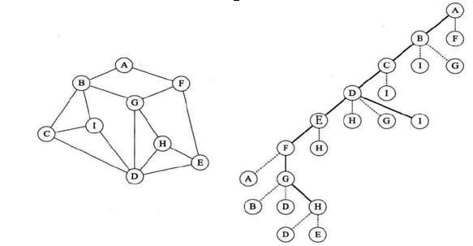

# Graph for Java

## DFS(depth first search)图的深度优先遍历



```
/**
 * 深度优先遍历<br>
 * 依次优先遍历顶点A的第一个邻接点，并且已遍历的点不可被重复遍历，当邻接点遍历完成遍历顶点A的其他节点。<br>
 * 已被遍历过的顶点不参与后序遍历
 *
 * @param startVertex
 */
private void depthFirstSearch(int startVertex) {
    //标记当前顶点已被遍历
    visited[startVertex] = true;
    int vertex = getVertexNeighbor(startVertex);
    while (vertex != -1) {
        if (!visited[vertex]) {
            //该顶点未被遍历过
            System.out.println("遍历顶点：" + vertex);
            depthFirstSearch(vertex);
        }
        //遍历当前顶点的同级顶点
        vertex = getNextVertex(startVertex, vertex);
    }

}
```
## DFS Test
### Test Code
```
GraphMatrix graph = new GraphMatrix(9);

int [] a1 = new int[]{0,10,MAX_WEIGHT,MAX_WEIGHT,MAX_WEIGHT,11,MAX_WEIGHT,MAX_WEIGHT,MAX_WEIGHT};
int [] a2 = new int[]{10,0,18,MAX_WEIGHT,MAX_WEIGHT,MAX_WEIGHT,16,MAX_WEIGHT,12};
int [] a3 = new int[]{MAX_WEIGHT,MAX_WEIGHT,0,22,MAX_WEIGHT,MAX_WEIGHT,MAX_WEIGHT,MAX_WEIGHT,8};
int [] a4 = new int[]{MAX_WEIGHT,MAX_WEIGHT,22,0,20,MAX_WEIGHT,MAX_WEIGHT,16,21};
int [] a5 = new int[]{MAX_WEIGHT,MAX_WEIGHT,MAX_WEIGHT,20,0,26,MAX_WEIGHT,7,MAX_WEIGHT};
int [] a6 = new int[]{11,MAX_WEIGHT,MAX_WEIGHT,MAX_WEIGHT,26,0,17,MAX_WEIGHT,MAX_WEIGHT};
int [] a7 = new int[]{MAX_WEIGHT,16,MAX_WEIGHT,MAX_WEIGHT,MAX_WEIGHT,17,0,19,MAX_WEIGHT};
int [] a8 = new int[]{MAX_WEIGHT,MAX_WEIGHT,MAX_WEIGHT,16,7,MAX_WEIGHT,19,0,MAX_WEIGHT};
int [] a9 = new int[]{MAX_WEIGHT,12,8,21,MAX_WEIGHT,MAX_WEIGHT,MAX_WEIGHT,MAX_WEIGHT,0};

graph.vertexMatrix[0] = a1;
graph.vertexMatrix[1] = a2;
graph.vertexMatrix[2] = a3;
graph.vertexMatrix[3] = a4;
graph.vertexMatrix[4] = a5;
graph.vertexMatrix[5] = a6;
graph.vertexMatrix[6] = a7;
graph.vertexMatrix[7] = a8;
graph.vertexMatrix[8] = a9;

graph.depthFirstSearch();

``` 
### DFS Test Log
```
遍历顶点：0
遍历顶点：1
遍历顶点：2
遍历顶点：3
遍历顶点：4
遍历顶点：5
遍历顶点：6
遍历顶点：7
遍历顶点：8
```

## BFS(broad first search)广度优先遍历
```
private void broadFirstSearch(int startVertex) {
    visited[startVertex] = true;
    LinkedList<Integer> queue = new LinkedList<>();
    //将顶点加入队列中
    queue.addFirst(startVertex);
    //遍历队列
    while (!queue.isEmpty()) {
        //出队
        int a = queue.removeFirst();
        //首先遍历顶点A
        int vertex = getVertexNeighbor(a);
        while (vertex != -1) {
            //判断是否遍历
            if (!visited[vertex]) {
                System.out.println("遍历顶点：" + vertex);
                visited[vertex] = true;
                //放入队列，队列遍历时进入下一层次
                queue.addFirst(vertex);
            }
            vertex = getNextVertex(a, vertex);
        }

    }
}

```
```
遍历顶点：0
遍历顶点：1
遍历顶点：5
遍历顶点：4
遍历顶点：6
遍历顶点：7
遍历顶点：3
遍历顶点：2
遍历顶点：8
```

## 使用普利姆算法实现图的最小生成树
```
/**
 * 使用普利姆算法实现图的最小生成树<br>
 * [0,10,#,#,#,11,#,#,#]<br>
 * 查找最小位索引位置<br>
 * .设 i = 1(10)<br>
 * .则 数列s为<br>
 * [10,0,18,#,#,#,16,#,12]<br>
 * 替换后<br>
 */
public void prim() {
    //最小权值集合
    int[] lowcost = new int[vertexSize];
    int[] weights = new int[vertexSize];
    int min, minId, weightSum = 0;

    //设置最小权值集合
    for (int i = 0; i < vertexSize; i++) {
        lowcost[i] = vertexMatrix[0][i];
    }

    //查找最小权值集合中最小索引位
    for (int j = 1; j < vertexSize; j++) {
        min = MAX_WEIGHT;
        minId = 0;
        for (int i = 1; i < vertexSize; i++) {
            if (lowcost[i] < min && lowcost[i] > 0) {
                min = lowcost[i];
                minId = i;
            }
        }
        //根据索引位置与最小权值中的数据比较
        //重置索引位置边
        lowcost[minId] = 0;
        weightSum += min;
        for (int i = 1; i < vertexSize; i++) {
            if (vertexMatrix[minId][i] < lowcost[i] && lowcost[i] > 0) {
                lowcost[i] = vertexMatrix[minId][i];
                weights[i] = minId;
            }
        }
    }

    System.out.println("最小生成树权值和：" + weightSum);
}
```